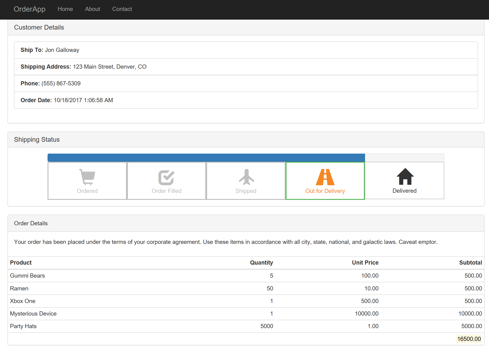

# Razor Pages example showing a complex page model

Part of what makes Razor Pages powerful is that it's easy to create and evolve a complex page model. In this case, we're showing an 
order status page that integrates shipping status, order details, customer information, etc.

